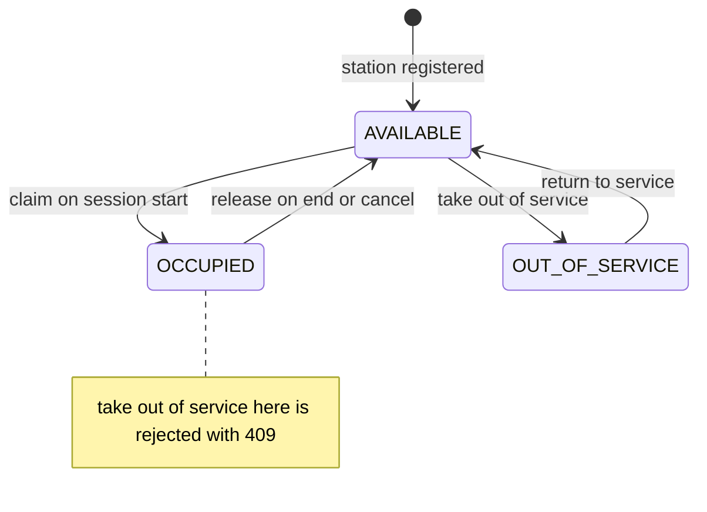
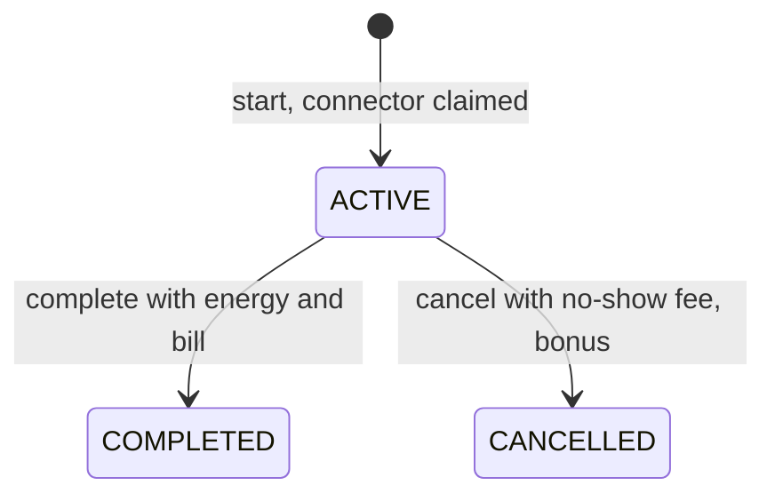

# EV Charging Network — Implementation Plan (v2, research-validated)

Status: planning only; no application code. v1 was written without the requested research. v2 comes from nine focused research agents (§19). They checked v1 against official docs and throwaway runs, and every change below comes from that work.

Tags: **[P]** established practice · **[C]** contextual recommendation · **[J]** personal judgment · **[X]** verified by execution · **[A#]** README assumption (§13).

---

## 1. Stack

**Selected: Python 3.14 + FastAPI (transport only) + pytest.** Everything else uses the standard library.
- Dependencies: `fastapi uvicorn` (runtime) and `httpx2 pytest` (test). That is 4 direct packages and 21 installed [X].
  - `pip install fastapi uvicorn pytest` alone is not enough. Importing `TestClient` raises `RuntimeError … requires the httpx2 package` [X]. Starlette 1.7 deprecates plain `httpx`, and FastAPI's testing page still says httpx because its docs lag behind.
  - Do not use `fastapi[standard]`: it installs 48 packages [X].
- Python version:
  - 3.12 now only gets security fixes. 3.14 is the newest bugfix-phase release. 3.15 is still a prerelease until 2026-10-01.
  - Set `requires-python = ">=3.11"`. The code uses only 3.10-era features (dataclass, Enum, `X | None`), and this machine's `python3` is 3.11.16 [X]. Don't use 3.12+ syntax such as `type` aliases or PEP 695 generics.
  - Develop and demo on 3.14 (`uv python install 3.14`), and record the interpreter in the README.
- Only `api.py` imports FastAPI. `domain`, `pricing`, `selection`, `store` and `service` import only the stdlib, so a CLI stays a one-file extension.

Scores run 1–5; higher is better for this exercise, and for setup/deps higher means lighter. Totals are unweighted.

| Criterion | **Py+FastAPI** | Py CLI (stdlib) | TS+Fastify/Express | Java 25+Spring Boot 4.1 | Java 25+Javalin 7 | Go 1.27 net/http |
|---|---|---|---|---|---|---|
| Language fit | 5 | 5 | 4 | 3 | 3 | 3 |
| Framework help (validation, OpenAPI) | 5 | 3 | 4 | 4 | 3 | 3 |
| Testing ecosystem | 5 | 5 | 5 | 5 | 4 | 4 |
| Dev velocity / live extension | 5 | 4 | 4 | 2 | 3 | 3 |
| Type safety | 3 | 2 | 4 | 5 | 5 | 4 |
| OOP support | 4 | 4 | 4 | 5 | 5 | 3 (interfaces, no inheritance) |
| Simplicity / explain every line | 4 | 5 | 3 | 1 | 3 | 4 |
| Setup | 4 | 5 | 3 | 2 | 3 | 5 |
| Dependency footprint [X] | 3 (21 pkgs) | 5 (5) | 2 (126) | 1 | 3 | 5 (0) |
| Money / decimal | 5 (`decimal`) | 5 | 2 (TC39 Decimal is Stage 1) | 5 (`BigDecimal`) | 5 | 3 (`big.Rat` or int paise) |
| Demoability | 5 (`/docs` free [X]) | 3 | 3 | 4 | 3 | 2 |
| In-memory + locking | 5 | 5 | 4 | 5 | 5 | 5 |
| **Total** | **53** | 51 | 42 | 42 | 45 | 44 |

AI-assist quality is left out because no source ranks it and it doesn't change the decision.

**Why the alternatives lost:**
- **Py CLI.** It is the close second. You would hand-write argument parsing, validation and a `cmd.Cmd` REPL. Races could only be shown in tests. The spec says "backend" for an "app", which points to HTTP.
- **TypeScript.** It has no native decimal, so money means int paise or `decimal.js`. Validation and an API explorer are plugins. "Build step" is no longer a valid objection: Node ≥ 24.12 strips types natively.
- **Spring Boot.** DI, annotations and Gradle/Maven are ceremony you'd have to defend. Every live change needs a controller, a DTO and a recompile.
- **Javalin / JDK HttpServer.** You still need a build tool plus Jackson. Java 25 has no stdlib JSON.
- **Go.** Money is clumsy (`big.Rat` or int paise), there is no API explorer, and decoding and validation are hand-written.

**Accepted trade-off:** type hints aren't enforced at runtime. Pydantic checks input at the HTTP boundary, and domain invariants plus tests cover the rest. mypy goes under "with more time", not "optional in CI".

**Transport: REST over CLI [C].**
- The process stays alive, so in-memory state survives between calls.
- Pydantic gives free input checking and 422s, and `/docs` gives the demo UI.
- Sync `def` routes run on AnyIO worker threads [X]. That makes the concurrency bonus real, not just something a test simulates.

---

## 2. Architecture

Presentation → service layer → behaviour-rich domain → concrete repository [P]. Fowler: "a small program may just put separate functions for the layers into different files."
- It meets the *intent* of hexagonal architecture without declared ports [C]. `ChargingService`'s public methods are the driving port, called by api.py and the tests. `InMemoryStore`'s method set is the driven port, and Cockburn himself names an in-memory DB as an adapter.

```text
api.py ──► service.py ──► selection.py ──► domain.py
  │            ├────────► pricing.py ────► domain.py
  │            └────────► store.py ──────► domain.py
  └─ composition root: InMemoryStore() + ChargingService(store, strategy, peak, clock)
domain.py imports only stdlib. Nothing imports api.py.
```

### Abstractions introduced (each tied to a requirement)
| Abstraction | Justification |
|---|---|
| `ConnectorType` Enum | AC/DC required. A new type is one member plus one `TARIFFS` entry. |
| `Tariff(minimum, slabs)` data + `energy_cost(kwh)` method | AC and DC need different tariffs. A new slab is a data change. |
| `FALLBACK = {AC: (DC,)}` data | AC→DC rule. Encodes A13/A15 literally, so a third type needs no branch edit. |
| `Candidate(station, connector, distance_km, multiplier)` frozen dataclass | Gives the strategies the facts they rank on, so `selection.py` never imports pricing or storage. |
| Strategies = key functions in `STRATEGIES` dict; selection is `min(cands, key=…)` | Bonus: nearest/cheapest/highest-power, switchable without touching session logic. |
| `PeakMultiplier = Callable[[datetime, Decimal], Decimal]` (time, load); `PEAKS` dict | Bonus: "pluggable multiplier based on time or station load". There are 2 real implementations. |
| Injected `clock: Callable[[], datetime]` | Time-based peak plus deterministic tests. |

### Not introduced (and why)
- **Repository interface.** There is one implementation. Extract a `Protocol` from InMemoryStore's methods when a second store exists.
- **DI container, Unit of Work, events, specifications, per-use-case classes, DTO mappers/presenters, ports/adapters folders.** Ceremony for this size.
- **`Money` class.** `Decimal` plus one `q()` helper is enough.
- **`Clock` class.** A callable does the job.
- **Tariff subclass hierarchy.** A battery swap fits the slab data (§14).
- **Selection `Protocol`.** Nothing to add over a key function.
- **One-member `PromoKind` enum.** It arrives with FLAT.
- **`config.py` / `errors.py` / `models.py`.**
- **Tariffs injected into the service.**
- **Pydantic `Field` constraints that repeat domain rules.** One rule, one owner.

### SOLID, honestly
- **S** — modules split by reason to change:
  - tariff policy → `pricing`
  - choosing a station → `selection`
  - state rules → `domain`
  - orchestration → `service`
  - storage → `store`
  - transport → `api`

  Lifecycle has no module of its own; it lives on the entities.
- **O** — strategies and peak rules are open for extension: a new function plus a dict entry, with the service untouched. Promos deliberately are *not* OCP while there's one kind; adding FLAT edits `apply()`.
- **L** — applies wherever implementations are swapped:
  - a strategy returns one of the given candidates, deterministically;
  - a peak multiplier returns a `Decimal > 0`;
  - a replacement store keeps InMemoryStore's semantics: `get_*` raises NotFound, and history comes back in `started_at` order.

  The promo contract `0 ≤ apply(x) ≤ x` becomes an LSP obligation once a second kind exists.
- **I** — irrelevant at this size.
- **D** — `ChargingService(store, strategy, peak, clock)`, built only in api.py. Strategy, peak and clock are true abstractions. The store is *injected but concrete*: dependency injection without inversion, and the README says so.

### What a DB swap really touches (README; don't overclaim)
The service mutates entities in place (`connector.claim()`, `session.complete()`), so persistence happens implicitly today. A DB swap means:
- a new store class with the same methods and semantics;
- explicit `save()` calls at about 6 mutation sites in service.py;
- one wiring line in api.py;
- replacing the lock's guarantee with a conditional `UPDATE` (§7).

Domain, pricing and selection don't change. Don't pre-add no-op `save()` calls; that would be YAGNI [J].

---

## 3. Domain model (`domain.py`)

| Kind | Name | Fields | Behaviour | Why |
|---|---|---|---|---|
| Enum | `ConnectorType` | `AC`, `DC` | — | Spec connector types |
| Enum | `ConnectorStatus` | `AVAILABLE`, `OCCUPIED`, `OUT_OF_SERVICE` | — | "free", out-of-service. 3 states are enough (A5). |
| Enum | `SessionStatus` | `ACTIVE`, `COMPLETED` (+ `CANCELLED` in the bonus commit) | — | Lifecycle + history |
| Data | `FALLBACK` | `{AC: (DC,)}` | — | AC→DC rule (A13) |
| VO | `Location` | `lat`, `lon` | `distance_km(other)` via haversine, R = 6371 km; range check | Station location + request position. Not stored on Driver. |
| VO | `Vehicle` | `model`, `supported_types: frozenset[ConnectorType]` (non-empty) | — | "their vehicle" / "compatible" (A1, A2). No id, no endpoints. |
| VO | `PromoCode` | `code` (non-empty, exact match), `percent_off: Decimal` in (0, 100] | `apply(amount)` → `amount × (100 − pct) / 100`, unrounded | Lives in domain because the session holds it. Putting it in pricing.py creates an import cycle [X]. |
| VO | `Bill` | `energy_cost`, `multiplier`, `minimum_applied`, `discount`, `total` | — | Itemised cost returned by end/cancel |
| Entity | `Driver` | `id`, `name`, `vehicle` | — | Register driver with vehicle |
| Entity (root) | `Station` | `id`, `name`, `location`, `connectors` (≥1, unique ids) | `free_connectors(type)` = `status is AVAILABLE`, a *positive* test; `connector(cid)` → NotFound; `load()` = occupied / in-service | "one or more connectors" |
| Entity (part) | `Connector` | `id` (1..n within the station), `type`, `power_kw > 0`, `status` | `claim`, `release`, `take_out_of_service`, `return_to_service` via `_move(expected, new)` | No station back-reference |
| Entity | `ChargingSession` | `id`, `driver_id`, `station_id`, `connector_id`, `billed_type`, `connector_type`, `promo: PromoCode \| None`, `multiplier` (bonus), `started_at`, `status`, `ended_at`, `energy_kwh`, `bill` | `complete(energy, bill, now)`, `cancel(bill, now)` (bonus) | See below |
| Errors | `DomainError` → `NotFound` (404), `Conflict` (409) → `NoConnectorAvailable`, `InvalidInput` (422) | | | Don't name it `ValidationError`: that clashes with Pydantic. |

Notes on `ChargingSession`:
- There is **one** type field for billing: `billed_type`, which is the requested type. `connector_type` is an immutable copy, so fallback shows up in history and in the bill without a lookup. The name `requested_type` is gone.
- `promo` is the frozen object looked up at start, not the code string. So delete → re-add → end still bills the original terms (A3) [X].
- `multiplier` is captured once at start (§4). Tariffs are constants; if they ever become editable at runtime, snapshot the `Tariff` the same way.

**Where behaviour lives.** Rules about a single object sit on that object: transitions, construction invariants, `free_connectors`, `distance_km`, `apply`. Cross-object rules have no single owner, so they sit in the service: radius, fallback, A4, strategy call, promo lookup, pricing call, end ordering, the lock. That split keeps the model from being anemic [P].

### Invariants → enforcement
| Invariant | Primary | Backstop |
|---|---|---|
| Connector in ≤1 ACTIVE session | `claim()` requires AVAILABLE (a state-machine invariant) | Service lock makes scan+claim atomic (§7) |
| OUT_OF_SERVICE never offered | `free_connectors()` positive `AVAILABLE` filter, the only route into candidates | `claim()` rejects non-AVAILABLE |
| Only an AVAILABLE connector can go out of service (A5) | `take_out_of_service()` | — |
| Only an OUT_OF_SERVICE connector can return to service | `return_to_service()`. Without this guard, an OCCUPIED connector could be "returned", double-booked, then double-freed. | — |
| End/cancel only from ACTIVE | `complete()` / `cancel()` | — |
| Driver ≤1 ACTIVE session (A4) | Service check **inside the start lock** [X] | — |
| Station ≥1 connector, unique ids, `power_kw > 0`; Vehicle types non-empty; lat/lon in range; promo pct in (0,100] | `__post_init__` → InvalidInput | — |
| `0 ≤ energy ≤ MAX_SESSION_KWH` | `pricing.price()`, runs before any state change | — |

### State machines (strict: any transition not drawn → `Conflict` 409)


**[A5] Taking an OCCUPIED connector out of service is rejected (409).** The operator ends or cancels the session first. The spec only needs "never *offered*", and an OCCUPIED connector is already not offered.
- Considered and rejected: a pending-out-of-service flag. It is a hidden 4th state plus a branch in `release()`, and is the upgrade path if mid-session faults matter.
- Reject also means `release()` can never fail after `complete()` succeeds, so no rollback code is needed.

---

## 4. Pricing (`pricing.py`)

### Money [P][X]
- **Representation:** `Decimal` rupees. Never `float`.
  - Request fields are typed `Decimal` in Pydantic. It parses the JSON text exactly (`0.1` → `Decimal('0.1')`) and rejects `NaN`, `Infinity` and non-numeric input with 422. The manual `Decimal(str(x))` step is deleted.
  - Responses are typed dataclasses, so Decimals serialize as JSON **strings** (`"207.00"`). A raw `dict` return would serialize them as JSON floats [X].
- **Rounding:** `q(x) = x.quantize(Decimal("0.01"), rounding=ROUND_HALF_UP)`, with the mode **passed explicitly every time**.
  - The default context is `ROUND_HALF_EVEN`.
  - Setting `getcontext()` in the main thread does *not* reach FastAPI's worker threads [X].
- **Where rounding happens:** at each displayed stage, not once at the end. Round-once gave 1,121 non-reconciling itemised bills out of 4,287 sampled [X].
- Minimums are written as `Decimal("150.00")` so that minimum-applied totals print as `"150.00"`.
- A18: rupees + half-up to paise is judgment. The nearest authoritative convention is RBI's round-half-up to the rupee for NBFCs, which is only an analogy (circular RBI/2013-14/609).

### Slab semantics — marginal [A6]
The labels are ordinals: "11–25 kWh" means the 11th through 25th kWh, i.e. the interval (10, 25]. So the bands are (0,10], (10,25], (25,∞), with no gaps for fractional energy. Whole-session-at-slab pricing is rejected because it has price cliffs: 25 kWh → ₹350 is more than 26 kWh → ₹234, and 10 → ₹200 is more than 10.01 → ₹150 [X].

### Tariffs (constants)
- **DC** (spec): min ₹150.00; ₹20 / ₹14 / ₹9 per kWh.
- **AC [A7]:** min ₹100.00; ₹15 / ₹10 / ₹6, using DC's bounds.
  - v1's AC tariff (₹15 then ₹12 flat) cost *more* than DC above 51.67 kWh (100 kWh: ₹1230 vs ₹1085), so the fallback rule would overcharge the driver it exists to protect [X].
  - The v2 values are ≤ DC at every energy: 0 violations over 0–2000 kWh in 0.01 steps [X].
  - The values themselves are judgment; the AC ≤ DC invariant is the defensible part.

### Pipeline (`price(tariff, energy, multiplier, promo) -> Bill`)
```text
guard       0 ≤ energy ≤ MAX_SESSION_KWH (1000) else InvalidInput      # A19; 1e30 would otherwise raise InvalidOperation → 500 [X]
energy_cost = q(tariff.energy_cost(energy))                           # marginal slabs
priced      = q(energy_cost × multiplier)                             # multiplier snapshotted at start; default 1   [A9]
subtotal    = max(priced, tariff.minimum)                             # minimum_applied = priced < minimum
total       = q(promo.apply(subtotal)) if promo else subtotal         # promo after the minimum   [A8]
discount    = subtotal − total                                        # derived → itemised bill always reconciles
```
- **A8.** A promo can take the bill below the minimum, down to ₹0. This is the only order in which every valid promo actually discounts: with the promo applied before the minimum, 5 kWh DC at 10% off is ₹150 either way [X].
- **A9.** The multiplier applies before the minimum, so the minimum stays a hard floor for any multiplier. Consequence: at ×1.5, DC sessions of ≤5 kWh cost the same at peak and off-peak. Document it.
- There is no "floor at 0" step: with pct in (0,100] it can't trigger. FLAT's `apply` brings its own `max(…, 0)`.

### Decision table (all rows reproduced by execution with the pipeline above)
| Case | kWh | ×mult | promo | energy_cost | subtotal | discount | **total** |
|---|---|---|---|---|---|---|---|
| DC | 0 / 5 / 7.5 | 1 | – | 0.00 / 100.00 / 150.00 | 150.00 (min) | 0.00 | **150.00** |
| DC | 10 | 1 | – | 200.00 | 200.00 | 0.00 | **200.00** |
| DC | 10.001 | 1 | – | 200.01 | 200.01 | 0.00 | **200.01** |
| DC | 10.5 | 1 | – | 207.00 | 207.00 | 0.00 | **207.00** |
| DC | 25 / 25.01 / 26 | 1 | – | 410.00 / 410.09 / 419.00 | same | 0.00 | **410.00 / 410.09 / 419.00** |
| DC | 100 | 1 | – | 1085.00 | 1085.00 | 0.00 | **1085.00** |
| DC | −1 · 1000.001 · NaN · "abc" | – | – | – | – | – | **422** |
| AC | 0 / 5 | 1 | – | 0.00 / 75.00 | 100.00 (min) | 0.00 | **100.00** |
| AC | 10 / 10.5 / 12.5 / 20 | 1 | – | 150.00 / 155.00 / 175.00 / 250.00 | same | 0.00 | **150.00 / 155.00 / 175.00 / 250.00** |
| AC | 25 / 26 / 100 | 1 | – | 300.00 / 306.00 / 750.00 | same | 0.00 | **300.00 / 306.00 / 750.00** |
| DC promo | 5 | 1 | 10% | 100.00 | 150.00 (min) | 15.00 | **135.00** (A8) |
| DC promo | 20 | 1 | 10% | 340.00 | 340.00 | 34.00 | **306.00** |
| DC promo | 5 | 1 | 100% | 100.00 | 150.00 | 150.00 | **0.00** |
| DC peak | 5 / 20 | 1.5 | – | 100.00 / 340.00 | 150.00 / 510.00 | 0.00 | **150.00 / 510.00** (A9) |
| DC peak+promo | 5 | 1.5 | 10% | 100.00 | 150.00 | 15.00 | **135.00** |
| Half-up tie | 7.50025 | 1 | – | 150.01 (HALF_EVEN would give 150.00) | 150.01 | 0.00 | **150.01** |
| Reconciliation | 7.5025 | 1 | 10% | 150.05 | 150.05 | 15.00 | **135.05** (exact 135.045, rounded up) |
| AC on DC connector | 20 | 1 | – | 250.00 | 250.00 | 0.00 | **250.00** (billed as DC: 340.00) |
| AC on DC connector | 5 | 1 | – | 75.00 | 100.00 (AC min) | 0.00 | **100.00** (billed as DC: 150.00) |
| AC on DC + promo | 20 | 1 | 10% | 250.00 | 250.00 | 25.00 | **225.00** (billed as DC: 306.00) |
| No-show cancel | – | – | – | – | – | – | **50.00** flat (A16) |

### Promo codes [A10, A11]
- **Validation at creation:** code non-empty; `0 < percent_off ≤ 100`.
  - 0% is rejected because the spec says a valid promo "gives a discounted price".
  - 100% (a free session) is allowed.
- **Matching:** exact, case-sensitive. That is zero code and avoids normalisation being repeated in add, delete and lookup. Normalisation is a one-helper live extension.
- **Lifecycle:** adding a duplicate code → 409, no silent overwrite. Deleting an unknown code → 404.
- **Use:** one promo per session, so no stacking; reuse is unlimited (A11). An unknown or deleted code at start → 422.

### Peak multiplier (bonus) [A20]
- `PEAKS = {"none": …, "time": by_time, "load": by_load}`.
  - `by_time`: ×1.5 between 18:00 and 22:00 IST. Use a fixed `+05:30` offset (`datetime.timezone`), not `zoneinfo`, which would need the `tzdata` package on Windows.
  - `by_load`: `1 + load/2`, where `load = occupied / in-service` at the candidate station, measured at start before the claim.
- It is evaluated **once, at start**, for each candidate, stored on `Candidate` and then on the session. So the rate a strategy ranks on is the rate billed, and `price()` stays pure (no clock, no store).

`NO_SHOW_FEE = Decimal("50.00")` and `MAX_SESSION_KWH = Decimal(1000)` live in pricing.py.

---

## 5. Station selection & AC→DC fallback (service + `selection.py`)

```text
for t in (requested, *FALLBACK.get(requested, ())):
    if t not in vehicle.supported_types: continue                         # A2
    cands = [Candidate(s, c, d, peak(now, s.load()))
             for s in store.list_stations()
             if (d := s.location.distance_km(here)) <= radius_km          # A12 inclusive
             for c in s.free_connectors(t)]
    if cands: break
else: raise NoConnectorAvailable                                          # 409
pick = min(cands, key=strategy)
```
Keys always end with distance, then ids, so ties are deterministic:
- `nearest`: `(d, station.id, connector.id)`
- `highest_power`: `(-power_kw, d, …)`
- `cheapest`: `(multiplier, d, …)`

Notes:
- **A13.** DC never falls back to AC. **A15.** A free AC *anywhere in the radius* beats a nearer free DC; that follows from the tiered loop.
- An OUT_OF_SERVICE AC isn't free, so it correctly triggers the fallback through the one filter.
- **A14.** Tariffs are global and every candidate shares `billed_type`, so `cheapest` differs from `nearest` only under the load-based peak. The README says so, and a demo of cheapest needs `EV_PEAK=load`.
- **Configuration.** `EV_STRATEGY` (default `nearest`) and `EV_PEAK` (default `time`) are read once in api.py. There is no `PUT /config/strategy`: the spec's "switch without modifying session logic" is about code structure, and a runtime endpoint adds shared mutable config that needs its own test. Tests inject strategies directly.
- **Scaling.** `# ponytail: linear scan over stations; geohash/PostGIS index when station count matters.`

---

## 6. Session lifecycle (all under the lock)

**Start:**
1. Load the driver (404).
2. A4: the driver has no ACTIVE session, else 409.
3. `requested ∈ vehicle.supported_types`, else 422.
4. Look up the promo, else 422.
5. Check `radius_km > 0` (422); `Location` validates lat/lon.
6. Build candidates and pick (§5).
7. `connector.claim()`.
8. Create the session with `billed_type = requested`, `connector_type`, `promo`, `multiplier`, `started_at = clock()`.

All validation runs before `claim()`, so a failed start never leaks a claimed connector.

**End:**
1. Load the session (404) and its connector.
2. Run `price()`. It is pure and may raise 422; nothing has changed yet.
3. `session.complete()`: 409 if not ACTIVE, so a double end is rejected before the connector is touched.
4. `connector.release()`.

**Cancel (bonus):** same order, with `pricing.no_show_bill()` instead of `price()`.
- A16: flat ₹50.00; no promo, peak or minimum. Only from ACTIVE.
- A session is claimed remotely while the driver is en route ("within a radius"), and "no-show" means they never plugged in.
- Trust model: callers are trusted, the same trust as the energy reported on end. So charge-then-cancel is possible and is documented, not coded. A grace window is a 3-line live extension.
- Ending with 0 kWh bills the minimum; no special case.

**History [A17]:** `GET …/sessions` → `{active, completed}`, plus `cancelled` once the bonus lands, grouped by status and ordered by `started_at`.
- An unknown driver or station → 404.
- A known driver with no sessions → empty lists.
- A no-show isn't mislabelled "completed"; the spec's two lists stay exactly as specified.

---

## 7. Concurrency (bonus, and a correctness need under FastAPI)

- **The race is real.** FastAPI runs sync `def` routes in a threadpool. A probe through FastAPI 0.141.1 double-booked with two concurrent requests [X]. **All routes are `def`**: `async def` would hide the race by accident, and a later blocking DB call would then stall the event loop.
- **One `threading.Lock` in `ChargingService`, taken by *every* public method** [X].
  - That includes registration, promo add/delete and history reads, not just start and end.
  - Why every method: iterating the store while another thread inserts raised `dictionary changed size during iteration` in two probes (82 per second; 191 of 1,025 scans) [X], and the A4 check is check-then-act across a driver's sessions [X].
  - One rule, no per-method argument.
- **`Lock`, not `RLock`.** Public methods never call each other; shared logic lives in private helpers that assume the lock is held. With one lock there's no ordering deadlock, and a nested call would hang on its first test run instead of shipping.
- **`claim()` raising is a state-machine invariant, not a concurrency guard.** It is itself check-then-act. Without the lock, the loser gets a generic 409 even when a second connector is free [X].
- **The GIL doesn't make check-then-act atomic.** The lock is also correct on free-threaded 3.14t (PEP 703/779).
- **Single process only [A21].** `uvicorn ev.api:app` with the default single worker; no `--workers`, and no `WEB_CONCURRENCY > 1`, which uvicorn reads by default. With N workers there are N stores, not just N locks.
- **Known limit:** responses are serialized after the lock is released, so a GET overlapping an end could show a half-updated session. It's cosmetic and documented; the fix would be to return copies.
- `# ponytail: one in-process lock = single-process ceiling. When persisted: partial UNIQUE indexes on sessions(connector_id) and sessions(driver_id) WHERE status='ACTIVE'; claim with UPDATE connectors SET status='OCCUPIED' WHERE id=? AND status='AVAILABLE' checking rowcount == 1, in the same transaction as the session INSERT; on 0 rows try the next candidate, else 409.` Per-station locks are dropped from the upgrade path: they help neither across processes nor with A4.

**Race test (`test_concurrency.py`).** A barrier at thread start alone never fails. It passed 2000/2000 runs *with the lock deleted* [X], so it proves nothing.
- Inject a test strategy, a key function that sleeps 50 ms, through the existing strategy parameter. Start two threads with `Barrier(2, timeout=5)`. Read results with a timeout so a deadlock fails instead of hanging.
- Parametrize the number of free connectors:

| Free connectors | Expected with the lock | Without the lock (mutation check) |
|---|---|---|
| 1 | outcomes = {OK, NoConnectorAvailable}; connector OCCUPIED; exactly 1 ACTIVE session | InvalidState: red, 20/20 with the 50 ms slow strategy [X] |
| 2 | both OK on distinct connectors | InvalidState: red, 20/20 in a variant that parked both threads at a barrier [X]. Re-check with the sleep strategy during the mutation run. |

Run the mutation once (delete the lock → red) and record it in the README.

---

## 8. Persistence
- **In memory:** everything, in `InMemoryStore`, one dict per entity kind; restart loses it (A21). The store owns per-kind `itertools.count(1)` ids, like a DB autoincrement [A22]. Connectors are numbered 1..n within their station.
- **Where the other data lives:** `TARIFFS`, `NO_SHOW_FEE`, `MAX_SESSION_KWH` and `PEAKS` in pricing.py; `STRATEGIES` in selection.py; wiring in api.py.
- **Store surface:** `add_*` (assigns the id), `get_*` (raises NotFound), `list_stations`, `sessions_for_driver`, `sessions_for_station`, `find_promo`, `delete_promo`.

---

## 9. API (`api.py`)

All routes are sync `def` with return-type annotations. Domain dataclasses are returned directly, with no response DTOs, and money is a JSON string. A `create_app(service=None)` factory gives each API test a fresh state; `app = create_app()` is kept for uvicorn.

| # | Method | Path | Spec | Request | Success | Errors |
|---|---|---|---|---|---|---|
| 1 | POST | /drivers | register driver + vehicle | `name, vehicle{model, connector_types[]}` | 201 Driver | 422 |
| 2 | POST | /stations | register station, ≥1 connector | `name, lat, lon, connectors[{type, power_kw}]` | 201 Station, with connector ids and statuses | 422 |
| 3 | POST | /stations/{sid}/connectors/{cid}/out-of-service | take out of service | — | 200 Connector | 404; 409 (occupied / already out) |
| 4 | POST | /stations/{sid}/connectors/{cid}/in-service | bring back | — | 200 Connector | 404; 409 |
| 5 | POST | /promos | add promo | `code, percent_off` | 201 PromoCode | 409 duplicate; 422 |
| 6 | DELETE | /promos/{code} | delete promo | — | 204 | 404 |
| 7 | POST | /sessions | start (+ fallback, + promo) | `driver_id, lat, lon, radius_km, connector_type, promo_code?` | 201 Session, showing `connector_type` and `billed_type` | 404 driver; 409 NoConnectorAvailable / active session; 422 promo / vehicle / radius |
| 8 | POST | /sessions/{id}/end | end with energy → cost | `energy_kwh` | 200 Session with `bill` | 404; 409; 422 |
| 9 | GET | /drivers/{id}/sessions | driver history | — | 200 `{active, completed[, cancelled]}` | 404 |
| 10 | GET | /stations/{id}/sessions | station history | — | same | 404 |
| 11 | POST | /sessions/{id}/cancel | bonus: no-show | — | 200 Session, `bill.total` = 50.00 | 404; 409 |

**Error model.** There is one `@app.exception_handler` per base class: `NotFound→404`, `Conflict→409`, `InvalidInput→422`. The body is `{"error": ClassName, "message": …}`. There is **no 400** and no `HTTPException`.
- RFC 9110: 422 means well-formed but semantically wrong, and 409 means a conflict with current state.
- FastAPI's own schema errors are 422 `{detail: […]}`; that format difference is accepted.
- Not built:
  - GET-by-id endpoints: every POST returns the full entity.
  - `GET /stations/nearby`: the spec folds search into start. It is a ~5-line live extension.

**Demo (8 min).** `demo.sh` holds the curl calls. It is not app code, and it makes a restart cheap. Start the server with `EV_PEAK=none uvicorn ev.api:app` so totals are deterministic; the breakdown shows the multiplier anyway. Seed:
- drivers Asha (AC+DC) and Ravi (AC only)
- station Koramangala (12.9352, 77.6245; AC 7.4 kW + DC 50 kW), 0.21 km from the driver point (12.9340, 77.6230)
- station Indiranagar (12.9784, 77.6408; AC), 5.30 km away [X]
- promo `WELCOME10` at 10%

Then:

| Step | Call | Expect |
|---|---|---|
| 1 | out-of-service Koramangala AC | 200 OUT_OF_SERVICE |
| 2 | Asha starts AC, radius 5, `WELCOME10` | **Edge case: fallback.** 201 on the DC connector; `connector_type: DC`, `billed_type: AC`. The out-of-service AC wasn't offered, and Indiranagar is outside the radius. |
| 3 | Ravi starts AC | **Edge case:** 409 NoConnectorAvailable. The AC is out, the DC is taken, Ravi is AC-only, and the other station is out of range. |
| 4 | out-of-service Koramangala DC (occupied) | 409 (A5) |
| 5 | end Asha, 12.5 kWh | bill: energy 175.00, discount 17.50, **total 157.50**. Billed as DC it would be 211.50 [X]. |
| 6 | in-service AC; Ravi retries | 201 on the AC connector; a connector back in service is offered again |
| 7 | end Ravi with −1, then 5 | 422, then **100.00** (AC minimum) |
| 8 | end Ravi again | 409 |
| 9 | histories: driver Asha, station Koramangala | active / completed split |
| 10 | DELETE `WELCOME10`; Asha starts with it | 204, then 422 |
| 11 | `pytest -q` | green |

Swagger's "Try it out" is expected to prefill optional strings with `"string"`, which would send an invalid promo. This is [INFERENCE] and hasn't been checked; clear the field, or use `demo.sh`.

---

## 10. Files

```text
ev/domain.py     enums, FALLBACK, Location, Vehicle, PromoCode, Bill, Connector, Station, Driver, ChargingSession, errors
ev/pricing.py    q(), Tariff, TARIFFS, MAX_SESSION_KWH, NO_SHOW_FEE, price(), no_show_bill(), PEAKS
ev/selection.py  Candidate, STRATEGIES (nearest / cheapest / highest_power key functions)
ev/store.py      InMemoryStore
ev/service.py    ChargingService(store, strategy, peak, clock) + the one lock
ev/api.py        create_app(), Pydantic request models, 3 exception handlers, env wiring
tests/test_pricing.py  test_domain.py  test_service.py  test_concurrency.py  test_api.py
demo.sh  README.md  pyproject.toml
```
Six source files. Split one only if it passes ~300 lines.

### Business rule → owner (single owner per rule)
| Rule | Owner |
|---|---|
| Radius (inclusive), haversine | `Location.distance_km` + the `<=` filter in the service |
| Compatibility and AC→DC fallback | `FALLBACK` data + the service's candidate loop |
| Billed at the requested type's tariff | `session.billed_type`, set once; `price(TARIFFS[billed_type], …)` |
| OUT_OF_SERVICE never offered | `Station.free_connectors` |
| Connector and session transitions | `Connector`, `ChargingSession` |
| ≥1 connector, value ranges | `__post_init__` of the owning object |
| Slabs, minimum, multiplier order, promo order, rounding, energy bounds | `pricing.price` |
| Promo validity at creation / at start / snapshot | `PromoCode.__post_init__` / service start / `session.promo` |
| Duplicate promo → 409; unknown on delete → 404 | service `add_promo` / store `delete_promo` |
| Peak evaluation time | service, at start, per candidate |
| Strategy choice | `selection.STRATEGIES`, injected |
| No-show fee | `pricing.no_show_bill` + `ChargingSession.cancel` |
| A4 + atomic start | service, inside the lock |
| History grouping | service (store filters, service groups) |
| Error → HTTP | api.py handlers |

---

## 11. Tests (~29 functions; stdlib + pytest; Hypothesis rejected as a new dependency)

| # | Test | Catches |
|---|---|---|
| P1 | `test_dc_tariff`, parametrized: 0, 5, 7.5, 10, 10.5, 25, 25.01, 26, 100 → §4 table | off-by-one at the slab bounds; whole-session semantics (25→350); minimum not applied |
| P2 | `test_ac_tariff`: 5→100.00, 10→150.00, 20→250.00, 26→306.00, 100→750.00 | AC priced with DC data |
| P3 | `test_promo_discount`: 10% on 5 kWh DC→135.00; 10% on 20 kWh→306.00; 100%→0.00 | promo applied before the minimum; negative total |
| P4 | `test_promo_validation`: 0, −5, 101, empty code rejected; 100 accepted | promos that give no discount or add money |
| P5 | `test_peak_before_minimum`: 5 kWh ×1.5→150.00; 20 kWh ×1.5→510.00 | multiplier after the minimum (→225) |
| P6 | `test_rounding`: 7.50025 kWh→150.01; 7.5025 kWh +10% → subtotal 150.05, total 135.05, `discount == subtotal − total` | default HALF_EVEN; non-reconciling breakdown |
| P7 | `test_tariff_grid`: 0→100 kWh in 0.025 steps; each price is non-decreasing and AC ≤ DC | a bad slab edit (live extension); a fallback that overcharges |
| P8 | `test_energy_bounds`: 0 and 1000 accepted; −1 and 1000.001 rejected | 500s on absurd input |
| D1 | `test_distance_known_values`: 1° lat ≈ 111.19 km; 1° lon at 60°N ≈ 55.60 km | degrees vs radians; swapped lat/lon. The radius tests can't catch these because they use `distance_km` to check itself. |
| D2 | `test_connector_invalid_transitions`: claim on OCCUPIED/OOS, take-out on OCCUPIED/OOS, return on AVAILABLE/OCCUPIED, release on AVAILABLE/OOS → Conflict | double-booking; an OOS connector claimable; return-while-occupied |
| D3 | `test_construction_invariants`: 0 connectors, `power_kw ≤ 0`, no vehicle types, lat 91 → InvalidInput | spec "one or more connectors" |
| S1 | `test_start_picks_nearest_free_compatible` | first-registered station chosen instead of the nearest |
| S2 | `test_radius_boundary`: `r = distance_km(a, b)` → starts; `r × 0.999` → 409 | `<` vs `<=`; a hand-picked radius breaking on float error |
| S3 | `test_out_of_service_never_offered_until_returned` | OOS offered; returned connector still hidden |
| S4 | `test_take_out_while_occupied_rejected`: 409; the session still ends; connector AVAILABLE | A5 |
| S5 | `test_type_selection_and_fallback`, 8 rows (below) | the fallback matrix |
| S6 | `test_fallback_billed_at_ac_with_promo`: 20 kWh +10% → 225.00, `billed_type` AC, `connector_type` DC | billing by connector type (→306.00) |
| S7 | `test_failed_start_claims_nothing`: unknown promo / deleted promo / A4 violation, then another driver can start | claim-before-validate leak |
| S8 | `test_promo_snapshot`: start with SAVE10=10%; delete; re-add SAVE10=50%; end → billed at 10% | lookup at end time |
| S9 | `test_driver_single_active_session` → 409 | A4 |
| S10 | `test_end_prices_and_releases`: another driver can then start | connector never released |
| S11 | `test_end_invalid_energy_keeps_session_active` | state changed before validation |
| S12 | `test_terminal_session_rejects_end_and_cancel`: {end, cancel} × {end, cancel}; another driver claims in between; the second op → 409 and the connector stays OCCUPIED | double bill; freeing another driver's connector |
| S13 | `test_history_grouping`: empty lists for a new driver; active/completed/cancelled split; station excludes other stations | wrong filter; 404 for a driver with no sessions |
| S14 | `test_cancel_charges_fee_and_releases` → 50.00 | bonus |
| S15 | `test_peak_uses_start_time`: clock starts 17:59 IST, ends 18:30 → ×1 | multiplier evaluated at end |
| S16 | `test_strategy_switch_changes_station`: nearest→A, highest_power→B, cheapest (`by_load`)→C | strategy ignored |
| C1 | `test_last_connector_race` (§7), params free = 1 and 2 | missing lock |
| A1 | `test_api_happy_path`: register → start → end; `total` is the string `"157.50"`; histories | model mismatch; float money; handler wiring |
| A2 | `test_api_error_mapping`: unknown session→404, no connector→409, end twice→409, unknown promo→422, `connectors: []`→422, energy −1→422, lat 91→422 | domain errors leaking as 500 |

S5 rows. The last column is the expected result, with the assumption it pins where one applies.

| req | vehicle | AC | DC | expected |
|---|---|---|---|---|
| AC | AC+DC | free | free | AC |
| AC | AC+DC | occupied | free | DC, billed AC |
| AC | AC+DC | out of service | free | DC, billed AC |
| AC | AC+DC | occupied | out of service | 409 |
| AC | AC only | occupied | free | 409 (A2) |
| DC | AC+DC | free | occupied | 409 (A13) |
| DC | AC only | free | free | 422 |
| AC | AC+DC | free, farther (in radius) | free, nearer | the farther AC (A15) |

**Cut from v1:**
- The 10⁶ kWh row: Decimal can't overflow there. Replaced by the bounds pair P8.
- Domain double-complete tests: S12 catches more.
- Valid-transition domain tests: every service test runs those paths.
- "Without touching service code": a design property, not testable.
- Case-insensitive promo test: that behaviour was dropped.

**Conventions:**
- Each test builds its own service through a tiny `make_service()` helper with a fixed `clock`.
- No conftest framework.
- No wall-clock, `datetime.now`, or shared app state.

---

## 12. Deliberately not built
- Auth.
- Payments.
- A real database.
- Pagination.
- A geospatial index.
- Reservations or holds separate from start.
- Auto-expiry of no-shows (needs a scheduler).
- Multi-vehicle drivers.
- Per-station or runtime-editable tariffs.
- Promo expiry and usage limits.
- Plug standards (Type 2 / CCS2 / CHAdeMO).
- Vehicle max-kW capping.
- An idle/overstay fee.
- A nearby-stations endpoint.
- A runtime strategy endpoint.
- async.
- Docker.
- mypy in CI.

---

## 13. Assumptions (README list)
| # | Assumption |
|---|---|
| A1 | One vehicle per driver. |
| A2 | AC→DC fallback requires the vehicle to support DC. |
| A3 | Promo (and multiplier) terms are fixed at start; later promo deletion or re-creation doesn't reprice. Tariffs are constants. |
| A4 | A driver has ≤1 ACTIVE session (follows from A1); checked inside the lock. |
| A5 | An OCCUPIED connector can't be taken out of service (409). Every undrawn transition → 409. |
| A6 | Marginal slabs; labels read as ordinals: (0,10], (10,25], (25,∞). |
| A7 | AC tariff: min ₹100; ₹15/₹10/₹6 on DC's bounds; AC ≤ DC at every energy. |
| A8 | Promo applies after the minimum, so a bill can drop below the minimum, down to ₹0. |
| A9 | Peak multiplier applies before the minimum, so the minimum is a hard floor. |
| A10 | Promo codes match exactly; they are unique (duplicate add → 409); `0 < pct ≤ 100`; one per session; an unknown or deleted code at start → 422. |
| A11 | Unlimited promo reuse. |
| A12 | Radius is inclusive; `radius_km > 0`; haversine with R = 6371 km; WGS84 degrees. |
| A13 | DC never falls back to AC. |
| A14 | `cheapest` ranks by the start-time multiplier; it only differs from `nearest` under the load-based peak. |
| A15 | A free AC anywhere in the radius beats a nearer free DC. |
| A16 | No-show fee is a flat ₹50 (no promo, peak or minimum); only from ACTIVE; callers are trusted. Ending with 0 kWh = the minimum. |
| A17 | History is grouped by status: active / completed / cancelled. |
| A18 | Money is Decimal rupees, rounded half-up to paise at each displayed stage; discount = subtotal − total; JSON strings. |
| A19 | `0 ≤ energy ≤ 1000 kWh`, any precision. |
| A20 | Peak hours are 18:00–22:00 IST (fixed +05:30), ×1.5. The load rule is `1 + load/2`, where load = occupied ÷ in-service connectors, measured at start. |
| A21 | Single process; in-memory; data is lost on restart. |
| A22 | Server-generated sequential integer ids; connector ids are per station. |
| A23 | No authentication; all callers are trusted. |

---

## 14. Live-extension readiness (rehearse the top rows)

| Change | Touch points | ~Lines | Verdict |
|---|---|---|---|
| Battery-swap connector | `ConnectorType.SWAP` + `TARIFFS[SWAP] = Tariff(minimum=299.00, slabs=((None, 0),))`, ended with 0 kWh; no `FALLBACK` entry | 3 + test | Do it live. No Tariff protocol: the fee is the minimum [X]. Ceiling: peak doesn't change a swap price (A9). |
| Flat promo | `PromoCode.kind` + `amount_off`; `apply` returns `max(amount − off, 0)`; validation; API field | 6 + test | Do it live. The floor arrives with FLAT. |
| New tariff slab | `TARIFFS` data + decision-table rows; P7 guards it | 1 + 2 | Do it live |
| Per-driver-once / max-uses / expiry promo | Derive from session history at the single promo check in start, under the lock. No separate used-set, which could drift. | 10 + test | Do it live. Known edge: a re-created code counts old uses. |
| Different peak rule | New function in `PEAKS` | 3 + test | Do it live |
| Per-request strategy | Optional `strategy` field on POST /sessions → `STRATEGIES[name]` | 3 + test | Do it live |
| No-show grace window | `cancel`: fee 0 if `now − started_at < GRACE` | 3 + test | Do it live |
| Nearby-stations GET | Reuse the candidate builder | ~5 | Do it live |
| Per-station tariffs (makes `cheapest` meaningful) | `Station.tariffs` + start-time lookup + snapshot the tariff on the session + nested slab DTO with validation | ~30 | Possible; talk it through first |
| Vehicle max kW | `Vehicle.max_kw`; `highest_power` ranks on `min(power_kw, max_kw)` | ~8 | Defer |
| Plug standards | `Connector.plug`, `Vehicle.plugs`, one extra filter; tariff stays keyed by AC/DC | ~15 | Defer |
| Multiple vehicles | `Driver.vehicles`, `vehicle_id` on start, rethink A4 | ~30 | Talk it through |
| Reservations | `RESERVED` status + expiry | 40–60 | Talk it through |
| CLI transport | `cli.py` calling the service | ~40 | Talk it through |
| SQLite | §2 "DB swap" + §7 upgrade path | 80+ | Talk it through |

---

## 15. Failure modes → mitigations (adversarial review, ranked)
| Sev | Failure mode | Mitigation (where) |
|---|---|---|
| must | A5 specified two ways; `return_to_service` unguarded → double-booking and double-free | Reject; explicit source state on every transition (§3; D2, S4) |
| must | Lock on only some methods → `dictionary changed size during iteration`; A4 bypass | Lock on every public method (§7) |
| must | Missing test HTTP client → `TestClient` import fails | `httpx2` in the test deps (§1) |
| should | Round-once breakdown doesn't reconcile | Per-stage rounding; discount derived (§4; P6) |
| should | NaN / Infinity / 1e30 energy → 500 | Pydantic `Decimal` field + domain bound (§4; P8) |
| should | Promo stored as a string → delete + re-add reprices a running session | Frozen `PromoCode` on the session (§3; S8) |
| should | Load-based multiplier read at end | Snapshot at start (§4; S15) |
| should | v1 AC tariff > DC above 51.67 kWh → fallback overcharges | AC 15/10/6 (§4; P7) |
| should | Race test passes without the lock | Slow injected strategy + mutation check (§7; C1) |
| should | Cancel semantics undefined (₹50 vs ₹150) | A16 trust model; only from ACTIVE |
| should | 400 vs 422 vs 404 disagree across sections | 3-class error model, no 400 (§9) |
| should | Client-supplied ids overwrite entities | Server-generated ids (A22) |
| should | `requested_type`/`billed_type` and `discount`/`apply` naming drift | One name each (§3, §4) |
| should | Tie-break by id picks a far station | Keys end with distance, then ids (§5) |
| should | README only written at the end | README from commit 1 (§16) |
| could | Peak window read in UTC | Fixed IST offset (A20) |
| could | Hand-picked boundary coordinates | Radius computed from `distance_km` (S2) |
| could | `config.py` phantom; §14 listed already-built bonus features as extensions | Removed |

---

## 16. Commit sequence (each commit green; README grows every commit)
1. `chore: skeleton` — pyproject (deps, `requires-python >=3.11`), empty package, README with assumption and AI-log sections.
2. `feat(pricing): ConnectorType, tiered tariffs, minimum, per-stage rounding` — P1, P2, P6, P7, P8.
3. `feat(domain): Location, Station/Connector state machine, Driver/Vehicle, Session` — D1–D3.
4. `feat(service): register, start/end within radius (nearest); one lock on every public method` — S1, S2, S10, S11.
5. `feat: out-of-service / in-service; never offered` — S3, S4.
6. `feat: AC→DC fallback billed at AC tariff` — S5, S6.
7. `feat: promo codes add/delete/apply with snapshot` — P3, P4, S7, S8.
8. `feat: driver and station history; one active session per driver` — S9, S13.
9. `feat(api): FastAPI transport, error mapping, demo.sh` — A1, A2.
10. `feat(bonus): peak multiplier (time/load), snapshotted at start` — P5, S15.
11. `feat(bonus): nearest/cheapest/highest-power via EV_STRATEGY` — S16.
12. `feat(bonus): cancellation with no-show fee` — S12, S14; history gains `cancelled`.
13. `test(bonus): last-connector race` — C1; mutation check recorded in the README.
14. `docs: trade-offs, more-time list, requirement→test table, verification log`.

`ConnectorType` is created in commit 2 because `TARIFFS` is keyed by it. The lock lands in commit 4 because the API in commit 9 makes the service concurrent.

---

## 17. AI usage protocol
- Prompt one module at a time, with the matching section of this plan as the spec. Never prompt "build the app".
- Write P1/P2/P6 by hand from §4's table *before* generating pricing code.
- Review every diff, and reject:
  - added layers (repository interfaces, DTO mappers, a Money class, config.py);
  - `float` money, or `quantize` without `rounding=`;
  - `async def` routes;
  - raw dict responses containing Decimals;
  - an unlocked public method;
  - promo lookup at end time;
  - billing by `connector_type`.
- Log each prompt, rejection and rewrite in the README's AI section **in the same commit**. The history should show it wasn't reconstructed afterwards.
- This plan itself: v1 was single-author. v2 was produced by 9 research agents and integrated by hand; §19 records what each changed.

## 18. Completion checklist
- [ ] Every mandatory **and bonus** requirement maps to a passing test (README table = the §11 coverage).
- [ ] `pytest -q` is green and warning-free from a clean clone (httpx2 installed, so no Starlette deprecation warning).
- [ ] Mutation checks done once and recorded:
  - delete the lock → C1 red;
  - drop `rounding=ROUND_HALF_UP` → P6 red;
  - bill by `connector_type` → S6 red.
- [ ] `demo.sh` runs end to end against `EV_PEAK=none uvicorn ev.api:app` (single worker) and matches the §9 numbers.
- [ ] README sections: assumptions A1–A23, design decisions, trade-offs (including the honest DB-swap and single-process notes), more-time list, AI usage, interpreter version.
- [ ] `git log` shows the §16 sequence.
- [ ] You can explain every file without looking, including why each §2 "not introduced" item is absent.

---

## 19. Research provenance
Nine independent agents each reviewed v1 in one focused area, reading official docs and running throwaway scripts in `/tmp` (since deleted). The integrator vetted conflicts and re-ran the §4 table, the AC ≤ DC sweep, the demo distances and `min()`'s key call.

| Agent | Key changes to v1 | Evidence |
|---|---|---|
| Stack | Python 3.12 → 3.14 (3.12 is security-only); `httpx2` is required; 21 installed packages, not "3 deps"; TS "build step" objection outdated; Go OOP rescored; Decimal thread-context and dict-serialization traps | devguide.python.org/versions; FastAPI async, first-steps and testing docs; Starlette release notes; Pydantic standard-types docs; TC39 proposal-decimal; Node TypeScript docs; runs on CPython 3.14.7 |
| Domain | A5 contradiction resolved to reject; `billed_type` as the single name; promo held as a frozen object; `PromoCode` moved to domain (import cycle); construction invariants; CANCELLED only in the bonus commit | Fowler: ValueObject, AnemicDomainModel; import-cycle probe |
| Pricing | All DC rows confirmed; AC tariff error fixed; per-stage rounding; energy upper bound; 0% promo rejected; minimum literal fixed | Executed sweeps; Python decimal docs; RBI circular RBI/2013-14/609 (analogy only) |
| Architecture | Store injected; `config.py` removed; honest DB-swap statement; Liskov/SRP/OCP corrected; rule→owner table; one error-class tree | Fowler: layering, Service Layer, Repository; Cockburn: hexagonal; Liskov & Wing 1994; RFC 9110 |
| API | `PUT /config/strategy` cut; no 400; return dataclasses (Decimal as strings); drop `Decimal(str(x))`; `def` routes; demo script | FastAPI async, handling-errors and response-model docs; RFC 9110 §15.5; probes on FastAPI 0.141.1 |
| Tests | Race test proven non-discriminating and redesigned; haversine known values; failed-start leak; terminal-state double release; 29-function matrix; Hypothesis rejected | Executed 2000-run probes; pytest parametrize docs; threading Barrier docs |
| Concurrency | Lock on every public method; `Lock` not `RLock`; `claim()` reframed; single-process caveat; DB upgrade path via partial unique index + conditional UPDATE | FastAPI async + deployment docs; uvicorn settings; Python glossary/threadsafety; PEP 703/779; PostgreSQL transaction-iso, UPDATE, partial-index docs; SQLite partial index |
| Live extension | Terms snapshotted at start; `Candidate` + key-function strategies; `FALLBACK` as data; distance tie-break; battery swap fits the slab model; §14 rebuilt | Executed checks (swap pricing, tie-break, IST offset); Python datetime/zoneinfo docs |
| Adversarial | 24 failure modes (3 must); §15 | Executed probes (dict iteration, NaN/Infinity, race); cross-checks above |

**Evidence gaps (stated, not papered over):**
- No authoritative source for real Indian AC vs DC per-kWh prices, for how to read the spec's slab labels, or for an EV/merchant rounding rule. Those choices are judgment and are listed as assumptions.
- No source ranks AI-assist quality by stack.
- Java and Go claims come from official docs only: neither toolchain was installed.
- The Swagger `"string"` prefill wasn't checked in a browser.
