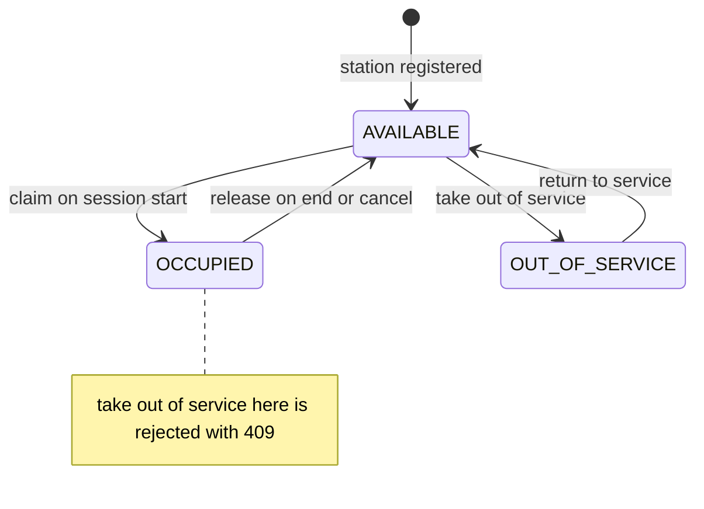
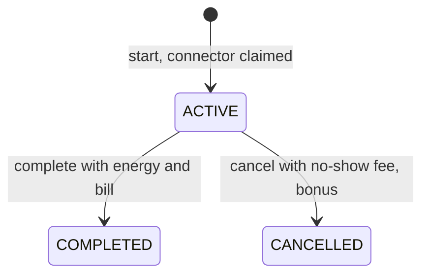

# EV Charging Network — backend

An in-memory backend for an EV charging network. Drivers register a vehicle. A session is started by searching a radius for a free, compatible connector, with AC→DC fallback, and is billed on tiered AC/DC tariffs with optional promo codes. The domain, pricing, selection and service layers are plain Python and use only the standard library. FastAPI is used only as the HTTP transport.

Implemented:

| Area | Scope |
|---|---|
| Mandatory | Register drivers with a vehicle; register stations with one or more AC/DC connectors; take connectors out of service and return them; start a session at the nearest free compatible connector within a radius; AC→DC fallback billed at the AC tariff; end a session with energy → itemised cost (tiered slabs + minimum); add/delete/apply promo codes; driver and station session history; one active session per driver |
| Bonus: peak multiplier | Pluggable `(time, load) → multiplier`: `none`, `time` (×1.5 18:00–21:59 IST), `load` (`1 + load/2`); snapshotted at start |
| Bonus: switchable strategy | `nearest`, `cheapest`, `highest_power` as sort keys, selected with `EV_STRATEGY` |
| Bonus: cancellation | No-show cancel with a flat ₹50.00 fee; releases the connector |
| Bonus: concurrency safety | One lock across every public service method; a race test for the last free connector |

## Quick start

Python ≥ 3.11. Developed on CPython 3.14 via uv.

```bash
# uv
uv venv -p 3.14 .venv
uv pip install --python .venv/bin/python -r pyproject.toml --extra test

# or plain pip
python3 -m venv .venv && .venv/bin/pip install fastapi uvicorn pytest httpx2

# tests
.venv/bin/pytest -q

# server
EV_PEAK=none .venv/bin/uvicorn ev.api:app
```

Run a **single process only**. Don't pass `--workers` and don't set `WEB_CONCURRENCY` > 1. The store is in memory and the lock is in-process, so N workers would mean N independent stores.

- Swagger UI: `http://127.0.0.1:8000/docs`
- Scripted walkthrough: `./demo.sh` against a **fresh** server (ids are deterministic). `./demo.sh seed` only seeds.

| Env var | Values | Default |
|---|---|---|
| `EV_STRATEGY` | `nearest` \| `cheapest` \| `highest_power` | `nearest` |
| `EV_PEAK` | `none` \| `time` \| `load` | `time` |

## API

| Method | Path | Purpose | Success |
|---|---|---|---|
| POST | `/drivers` | Register a driver with a vehicle | 201 Driver |
| POST | `/stations` | Register a station with ≥1 connector | 201 Station |
| POST | `/stations/{station_id}/connectors/{connector_id}/out-of-service` | Take a connector out of service | 200 Connector |
| POST | `/stations/{station_id}/connectors/{connector_id}/in-service` | Return a connector to service | 200 Connector |
| POST | `/promos` | Add a promo code | 201 PromoCode |
| DELETE | `/promos/{code}` | Delete a promo code | 204 (no body) |
| POST | `/sessions` | Start a session (radius search, fallback, promo) | 201 ChargingSession |
| POST | `/sessions/{session_id}/end` | End with energy → bill | 200 ChargingSession |
| POST | `/sessions/{session_id}/cancel` | No-show cancel, ₹50.00 fee | 200 ChargingSession |
| GET | `/drivers/{driver_id}/sessions` | Driver history | 200 `{active, completed, cancelled}` |
| GET | `/stations/{station_id}/sessions` | Station history | 200 `{active, completed, cancelled}` |

**Error model.** There is one handler per domain base class, and the body is `{"error": <ClassName>, "message": <text>}`.

| Exception | Status | Meaning |
|---|---|---|
| `NotFound` | 404 | Unknown driver, station, connector, session or promo (on delete) |
| `Conflict` | 409 | Illegal state transition, driver already active, duplicate promo |
| `NoConnectorAvailable` (subclass of `Conflict`) | 409 | Nothing free and compatible in the radius |
| `InvalidInput` | 422 | Well-formed request that violates a business rule |

FastAPI's own schema-validation errors are also 422, but with its `detail` body shape. No endpoint returns 400.

**Representation.**
- Money and energy are `Decimal` and serialize as JSON strings (`"157.50"`).
- Ids are server-generated sequential integers, counted separately for each kind (driver, station, session).
- Connector ids are numbered 1..n within their station.

## Design

### Architecture

```text
api.py ──► service.py ──► selection.py ──► domain.py
  │            ├────────► pricing.py ────► domain.py
  │            └────────► store.py ──────► domain.py
  └─ composition root: InMemoryStore() + ChargingService(store, strategy, peak, clock)
domain.py imports only stdlib. Nothing imports api.py.
```

| Module | Responsibility |
|---|---|
| `ev/domain.py` | Enums, `FALLBACK`, value objects, entities with their state machines, error classes |
| `ev/pricing.py` | `q()`, `Tariff`, `TARIFFS`, `price()`, `no_show_bill()`, peak rules (`PEAKS`) |
| `ev/selection.py` | `Candidate`, strategy key functions (`STRATEGIES`) |
| `ev/store.py` | `InMemoryStore`: dicts and per-kind id counters |
| `ev/service.py` | `ChargingService`: use cases, cross-object rules, the lock |
| `ev/api.py` | FastAPI app, request models, error mapping, env wiring |

The structure is a service layer over a behaviour-rich domain, with a concrete store. It meets the intent of hexagonal/clean architecture without the ceremony. `ChargingService`'s public methods are the driving port, used by both the API and the tests. `InMemoryStore`'s method set is the driven port. There are no port interfaces, DI container or adapter folders, because each would have exactly one implementation.

### Domain model

| Kind | Name | Notes |
|---|---|---|
| Enum | `ConnectorType` | `AC`, `DC` |
| Enum | `ConnectorStatus` | `AVAILABLE`, `OCCUPIED`, `OUT_OF_SERVICE` |
| Enum | `SessionStatus` | `ACTIVE`, `COMPLETED`, `CANCELLED` |
| Data | `FALLBACK` | `{AC: (DC,)}`; DC never falls back |
| Value object | `Location` | `lat`, `lon`; range-checked; `distance_km()` uses haversine with R = 6371 km |
| Value object | `Vehicle` | `model`, non-empty `supported_types` |
| Value object | `PromoCode` | `code`, `percent_off` in (0, 100]; `apply()` returns the amount unrounded |
| Value object | `Bill` | `energy_cost`, `multiplier`, `minimum_applied`, `discount`, `total` |
| Entity | `Station` | `connectors` (≥1, unique ids); `free_connectors(type)`, `connector(id)`, `load()` |
| Entity | `Connector` | `type`, `power_kw > 0`, `status`; `claim`/`release`/`take_out_of_service`/`return_to_service` |
| Entity | `Driver` | `name`, `vehicle` |
| Entity | `ChargingSession` | `billed_type` (requested) and `connector_type` (used); promo and multiplier snapshots; `complete()`, `cancel()` |

Any transition not drawn below raises `Conflict` (409).





### Pricing

Slabs are marginal: each band prices only the kWh that fall inside it.

| Tariff | Minimum | 0–10 kWh | 10–25 kWh | > 25 kWh |
|---|---|---|---|---|
| DC | ₹150.00 | ₹20/kWh | ₹14/kWh | ₹9/kWh |
| AC | ₹100.00 | ₹15/kWh | ₹10/kWh | ₹6/kWh |

Other constants: `MAX_SESSION_KWH = 1000`, `NO_SHOW_FEE = 50.00`. Rounding is `q(x)`, which quantizes to 0.01 with an explicit `ROUND_HALF_UP`.

`price(tariff, energy_kwh, multiplier=1, promo=None)`:

1. Guard: `0 ≤ energy_kwh ≤ 1000` and finite, else `InvalidInput`.
2. `energy_cost = q(tariff.energy_cost(energy_kwh))`
3. `priced = q(energy_cost × multiplier)`
4. `minimum_applied = priced < minimum`; `subtotal = max(priced, minimum)`
5. `total = q(promo.apply(subtotal))` if there is a promo, else `subtotal`
6. `discount = subtotal − total`, so the itemised bill always reconciles.

Worked examples:

| Case | Calculation | Total |
|---|---|---|
| DC 5 kWh | 5 × 20 = 100.00 < 150.00 | **150.00** (minimum) |
| DC 10.5 kWh | 10 × 20 + 0.5 × 14 | **207.00** |
| DC 26 kWh | 200 + 15 × 14 + 1 × 9 | **419.00** |
| AC 12.5 kWh, 10% promo | 150 + 2.5 × 10 = 175.00; −17.50 | **157.50** |
| AC-billed on a DC connector, 20 kWh | 150 + 10 × 10 = 250.00 | **250.00** (340.00 if billed DC) |
| DC 5 kWh at ×1.5 | q(100.00 × 1.5) = 150.00 ≥ minimum | **150.00** |
| DC 7.50025 kWh | 150.005 → HALF_UP | **150.01** (HALF_EVEN would give 150.00) |

A no-show cancel is billed a flat `Bill(0.00, 1, False, 0.00, 50.00)`, with no promo, peak or minimum.

### Station selection and fallback

```text
for t in (requested, *FALLBACK.get(requested, ())):
    if t not in vehicle.supported_types: continue
    cands = _candidates(here, radius_km, t, now)   # distance <= radius (inclusive), free connectors of t
    if cands: break
else: raise NoConnectorAvailable                   # 409
pick = min(cands, key=strategy)
```

- The search is tiered: a free AC connector anywhere in the radius beats a nearer free DC. The session is always billed at `billed_type = requested`.
- `free_connectors()` is a positive `status is AVAILABLE` filter, so out-of-service and occupied connectors are never offered.
- The peak multiplier is computed once per candidate station, before the claim, and stored on the `Candidate`. The rate a strategy ranks on is the rate that gets billed.

| Strategy | Sort key |
|---|---|
| `nearest` | `(distance_km, station.id, connector.id)` |
| `cheapest` | `(multiplier, distance_km, station.id, connector.id)` |
| `highest_power` | `(-power_kw, distance_km, station.id, connector.id)` |

Caveat on `cheapest`: tariffs are global and every candidate in a call shares the billed type, so `cheapest` ranks on the multiplier only. It differs from `nearest` only under `EV_PEAK=load`.

### Session lifecycle

- **Start:**
  1. Load the driver (404).
  2. Reject if the driver already has an active session (409).
  3. Reject if the vehicle doesn't support the requested type (422).
  4. Reject an unknown promo code (422).
  5. Reject `radius_km ≤ 0` (422).
  6. Build candidates and pick one.
  7. `claim()` the connector, then create the session.

  All validation runs before `claim()`, so a failed start leaves nothing claimed.
- **End:**
  1. Load the session and its connector.
  2. `price()`. It is pure and may raise 422 before anything changes.
  3. `session.complete()`. It raises 409 if the session isn't ACTIVE, before the connector is touched.
  4. `connector.release()`.
- **Cancel:** same order as end, with `no_show_bill()`.
- **History:** check existence (404), then group by status into `{"active", "completed", "cancelled"}`. All three keys are always present, and each list is in start order.

### Concurrency

- **One `threading.Lock` on every public service method,** including registration, promo add/delete and history reads. There are two reasons:
  - Iterating the store's dicts while another thread inserts raises `dictionary changed size during iteration`.
  - The one-active-session check (A4) is check-then-act.

  Public methods never call each other, and private helpers assume the lock is held. That is why this is `Lock`, not `RLock`.
- **All routes are plain `def`,** so FastAPI runs them on a threadpool. The race is real, and a future blocking DB call won't stall the event loop.
- **`Connector.claim()` raising on a non-AVAILABLE connector is a state-machine invariant, not a concurrency guard.** It is check-then-act itself. Without the lock, the losing request would get a generic `Conflict` even when another connector is free.
- **Single process only.** The lock and the store both live in one process.
- **Race test (C1).** A barrier alone doesn't discriminate: two threads released together can still serialize. So the test injects a strategy that sleeps 50 ms, which widens the scan→claim window. Two threads start behind a `Barrier(2, timeout=5)`, and results are read with a timeout so a deadlock fails instead of hanging. The test is parametrized over 1 and 2 free connectors.
- **DB upgrade path:**
  - Partial unique indexes on `sessions(connector_id)` and `sessions(driver_id)` `WHERE status='ACTIVE'`.
  - Claim with `UPDATE connectors SET status='OCCUPIED' WHERE id=? AND status='AVAILABLE'`, checking `rowcount == 1`, in the same transaction as the session INSERT.
  - On 0 rows, try the next candidate; else 409.

### Persistence

Everything is held in memory in `InMemoryStore` and lost on restart. The service mutates entities in place, so persistence is implicit today. Swapping in a database honestly touches:

- a new store class with the same methods and semantics;
- explicit `save()` calls at about 6 mutation sites in `service.py`;
- 1 wiring line in `api.py`;
- a conditional `UPDATE` (above) replacing the lock's guarantee.

Domain, pricing and selection don't change.

## Assumptions

| # | Assumption |
|---|---|
| A1 | One vehicle per driver. |
| A2 | AC→DC fallback requires the vehicle to support DC. |
| A3 | Promo and multiplier terms are fixed at start; later promo deletion or re-creation doesn't reprice. Tariffs are constants. |
| A4 | A driver has ≤1 ACTIVE session (follows from A1); checked inside the lock. |
| A5 | An OCCUPIED connector can't be taken out of service (409). Every undrawn transition → 409. |
| A6 | Marginal slabs; labels read as ordinals: (0,10], (10,25], (25,∞). |
| A7 | AC tariff: min ₹100; ₹15/₹10/₹6 on DC's bounds; AC ≤ DC at every energy. |
| A8 | Promo applies after the minimum, so a bill can drop below the minimum, down to ₹0. |
| A9 | Peak multiplier applies before the minimum, so the minimum is a hard floor. |
| A10 | Promo codes match exactly (case-sensitive) and are unique (duplicate add → 409); `0 < pct ≤ 100`; one per session; an unknown or deleted code at start → 422; deleting an unknown code → 404. |
| A11 | Unlimited promo reuse. |
| A12 | Radius is inclusive; `radius_km > 0`; haversine with R = 6371 km; WGS84 degrees. |
| A13 | DC never falls back to AC. |
| A14 | `cheapest` ranks by the start-time multiplier; it only differs from `nearest` under the load-based peak. |
| A15 | A free AC anywhere in the radius beats a nearer free DC. |
| A16 | No-show fee is a flat ₹50 (no promo, peak or minimum); only from ACTIVE; callers are trusted. Ending with 0 kWh = the minimum. |
| A17 | History is always three lists grouped by status: `active`, `completed`, `cancelled`, in start order. |
| A18 | Money is Decimal rupees, rounded half-up to paise at each displayed stage; discount = subtotal − total; JSON strings. |
| A19 | `0 ≤ energy ≤ 1000 kWh`, any precision. |
| A20 | Peak hours are 18:00–22:00 IST (fixed +05:30), ×1.5. The load rule is `1 + load/2`, rounded to 2 dp, where load = occupied ÷ in-service connectors, measured at start. |
| A21 | Single process; in-memory; data is lost on restart. |
| A22 | Server-generated sequential integer ids; connector ids are per station. |
| A23 | No authentication; all callers are trusted. |

## Design decisions and trade-offs

| Decision | Why | Accepted cost |
|---|---|---|
| Python + FastAPI (transport only) + pytest | Native `Decimal`, free validation and `/docs`, fast to change live | 21 installed packages; type hints not enforced at runtime |
| Concrete `InMemoryStore`, no repository interface | One implementation; extract a Protocol when a second store exists | A DB swap edits the service (see Persistence) |
| Behaviour on entities, thin orchestration service | Single-object rules live on the object; only cross-object rules sit in the service | The service holds the fallback, A4 and ordering logic |
| `Decimal` with per-stage `ROUND_HALF_UP` | Exact money; the itemised bill reconciles line by line | Rounding mode written explicitly at every call |
| Marginal slabs | No price cliffs (whole-session pricing makes 25 kWh cost more than 26) | One reading of an ambiguous spec (A6) |
| AC tariff ≤ DC at every energy | Fallback must never overcharge the driver it exists to protect | AC rates are judgment |
| Promo after the minimum; peak before it | Every valid promo actually discounts; the minimum stays a hard floor under peak | A promo can take a bill below the minimum; small peak sessions cost the same as off-peak |
| Reject out-of-service while occupied | No hidden fourth state; `release()` can't fail after `complete()` | Operator must end or cancel first |
| Snapshot promo and multiplier at start | Deleting or re-creating a promo, or load changes, never reprice a running session | Fields duplicated on the session |
| Strategies as sort keys + env config, no runtime endpoint | `min(cands, key=…)` switches behaviour without touching session logic | Changing strategy needs a restart |
| One global lock + `def` routes | Simple, provably correct, covers every read and write | Single-process throughput ceiling |
| Domain dataclasses returned directly, no DTOs | One model; Decimals serialize as strings | The API shape is coupled to the domain fields |
| Exact-match promo codes | No normalisation to repeat across add, delete and lookup | `welcome10` ≠ `WELCOME10` |

## What I would change with more time

- Postgres, with partial unique indexes on active sessions and a conditional `UPDATE … WHERE status='AVAILABLE'` claim replacing the lock.
- Authentication and operator/driver roles.
- Per-station tariffs, snapshotted on the session (this also makes `cheapest` meaningful).
- Promo usage limits, per-driver-once and expiry.
- Reservations, with no-show auto-expiry (needs a scheduler).
- mypy in CI.
- Idempotency keys on start/end/cancel.
- Observability: structured logs, metrics, tracing.

## Live extension notes

| Change | Touch points | ~Lines | Verdict |
|---|---|---|---|
| Battery-swap connector | `ConnectorType.SWAP` + `TARIFFS[SWAP] = Tariff(minimum=299.00, slabs=((None, 0),))`, ended with 0 kWh; no `FALLBACK` entry | 3 + test | Do it live. The fee is the minimum; peak doesn't change it (A9). |
| Flat promo | `PromoCode.kind` + `amount_off`; `apply` returns `max(amount − off, 0)`; validation; API field | 6 + test | Do it live |
| New tariff slab | `TARIFFS` data; P7 guards monotonicity and AC ≤ DC | 1 + 2 | Do it live |
| Per-driver-once / max-uses / expiry promo | Derive from session history at the single promo check in start, under the lock | 10 + test | Do it live. A re-created code counts old uses. |
| Different peak rule | New function in `PEAKS` | 3 + test | Do it live |
| Per-request strategy | Optional `strategy` field on `POST /sessions` → `STRATEGIES[name]` | 3 + test | Do it live |
| No-show grace window | `cancel`: fee 0 if `now − started_at < GRACE` | 3 + test | Do it live |
| Nearby-stations GET | Reuse the candidate builder | ~5 | Do it live |

and demo script`
7. `docs: README with design, assumptions, trade-offs and AI usage`
